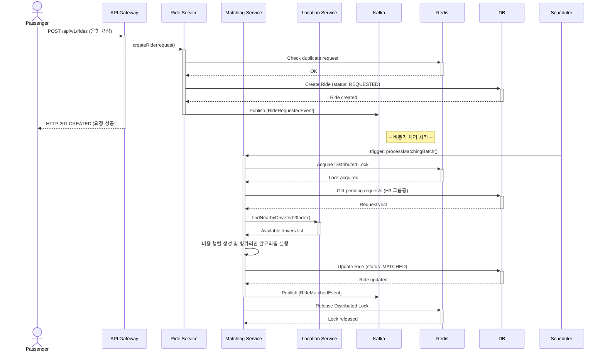

# ddak-ta

This project uses [Gradle](https://gradle.org/).
To build and run the application, use the *Gradle* tool window by clicking the Gradle icon in the
right-hand toolbar,
or run it directly from the terminal:

* Run `./gradlew run` to build and run the application.
* Run `./gradlew build` to only build the application.
* Run `./gradlew check` to run all checks, including tests.
* Run `./gradlew clean` to clean all build outputs.

Note the usage of the Gradle Wrapper (`./gradlew`).
This is the suggested way to use Gradle in production projects.

[Learn more about the Gradle Wrapper](https://docs.gradle.org/current/userguide/gradle_wrapper.html).

[Learn more about Gradle tasks](https://docs.gradle.org/current/userguide/command_line_interface.html#common_tasks).

This project follows the suggested multi-module setup and consists of the `app` and `utils`
subprojects.
The shared build logic was extracted to a convention plugin located in `buildSrc`.

This project uses a version catalog (see `gradle/libs.versions.toml`) to declare and version
dependencies
and both a build cache and a configuration cache (see `gradle.properties`).

## Matching Service Architecture

다음은 승객의 배차 요청부터 드라이버 매칭까지 이어지는 `matching-service`의 핵심 아키텍처 흐름을 나타낸 시퀀스 다이어그램입니다.

